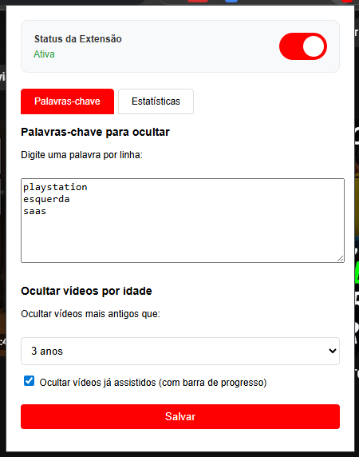
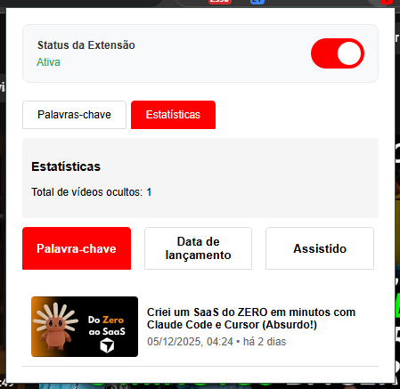

# YT Smart Filter

Extensão para Chrome que filtra e oculta vídeos do YT com base em palavras-chave, idade dos vídeos e status de visualização.





## Funcionalidades

- **Ativação/Desativação**: Toggle para ligar/desligar a extensão rapidamente
- **Filtro por palavras-chave**: Oculta vídeos que contenham palavras específicas no título
- **Filtro por idade**: Oculta vídeos mais antigos que um número específico de anos
- **Filtro de assistidos**: Oculta vídeos que já foram assistidos
- **Estatísticas**: Mostra quantos vídeos foram ocultados e por qual motivo

## Instalação

1. Baixe ou clone este repositório
2. Abra o Chrome e vá para `chrome://extensions/`
3. Ative o "Modo desenvolvedor" no canto superior direito
4. Clique em "Carregar extensão não empacotada"
5. Selecione a pasta da extensão

## Como usar

1. **Ativar/Desativar**: Clique no ícone da extensão e use o switch no topo
2. **Configurar palavras-chave**: Digite as palavras-chave que deseja filtrar (uma por linha) e clique em "Salvar"
3. **Configurar idade máxima**: Selecione a idade máxima dos vídeos que deseja ver
4. **Ocultar vídeos assistidos**: Marque a opção "Ocultar vídeos já assistidos"
5. **Ver estatísticas**: Clique na aba "Estatísticas" para ver os vídeos ocultos

## Estrutura dos arquivos

```
extension/
├── manifest.json          # Configuração da extensão
├── content.js            # Script principal que executa na página do YT
├── popup.js             # Lógica da interface popup
├── popup.html           # Interface HTML do popup
├── background.js        # Service worker para funcionalidades em background
├── icons/               # Ícones da extensão
│   └── icon.svg
└── README.md            # Este arquivo
```

## Solução de problemas

- **Extensão não funciona**: Verifique se está ativa em `chrome://extensions/` e se o switch no popup está ligado
- **Vídeos não são ocultados**: Confirme se as palavras-chave estão configuradas e recarregue a página
- **Performance**: Limpe os dados da extensão em `chrome://extensions/` → Detalhes → Limpar dados

## Licença

MIT